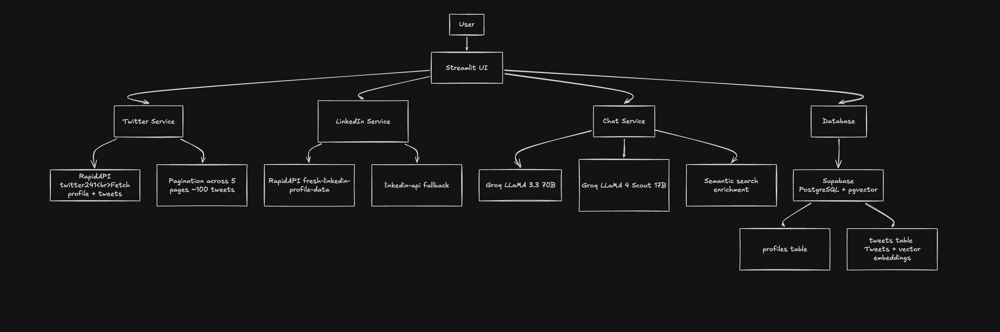

# Traceify

> Public profile intelligence — fetch anyone's X (Twitter) or LinkedIn profile and have a grounded AI conversation about them.

**Live demo**: [traceify.streamlit.app](https://traceify.streamlit.app)

---

## Architecture



---

## Features

- Fetch any public X (Twitter) profile by handle
- Multi-page tweet fetching with pagination (~100 tweets)
- Semantic search over tweets using pgvector
- Multi-turn AI chat powered by Groq LLaMA
- Profile and tweet caching in Supabase — no repeated API calls
- LinkedIn profile support (requires paid RapidAPI or LinkedIn credentials)
- Full error handling — private accounts, invalid URLs, rate limits

---

## Tech stack

| Layer | Technology |
|---|---|
| UI | Streamlit |
| Twitter data | RapidAPI twitter241 |
| LinkedIn data | RapidAPI fresh-linkedin-profile-data |
| AI chat | Groq — LLaMA 3.3 70B + LLaMA 4 Scout 17B |
| Database | Supabase (PostgreSQL + pgvector) |
| Embeddings | sentence-transformers (all-MiniLM-L6-v2) |
| Hosting | Streamlit Community Cloud |

---

## Local setup

### 1. Clone and install

```bash
git clone https://github.com/YOUR_USERNAME/traceify.git
cd traceify
python -m venv venv
source venv/bin/activate
pip install -r requirements.txt
```

### 2. Set up Supabase

Create a free project at [supabase.com](https://supabase.com), then run [`supabase/schema.sql`](supabase/schema.sql) in the SQL editor.

### 3. Configure secrets

Copy the example file and fill in your keys:

```bash
cp .streamlit/secrets.toml.example .streamlit/secrets.toml
```

Then edit `.streamlit/secrets.toml` with your actual values. See the example file for all required keys.

### 4. Run

```bash
streamlit run main.py
```

---

## Environment variables

| Variable | Required | Where to get |
|---|---|---|
| `GROQ_API_KEY` | Yes | [console.groq.com](https://console.groq.com) — free |
| `RAPIDAPI_KEY` | Yes | [rapidapi.com](https://rapidapi.com) — subscribe to twitter241 (free tier) |
| `SUPABASE_URL` | Yes | Supabase project → Settings → API |
| `SUPABASE_KEY` | Yes | Supabase project → Settings → API |
| `LINKEDIN_EMAIL` | No | Your LinkedIn account email |
| `LINKEDIN_PASSWORD` | No | Your LinkedIn account password |

---

## Project structure

```
Traceify/
├── main.py                  ← Homepage
├── pages/
│   ├── 1_🔍_Twitter.py      ← Twitter profile page
│   └── 2_💼_LinkedIn.py     ← LinkedIn profile page
├── utils/
│   ├── chat.py              ← AI chat + semantic search
│   ├── config.py            ← Settings
│   ├── db.py                ← Supabase layer
│   ├── design.py            ← UI render functions
│   ├── profiles.py          ← Profile models
│   ├── twitter.py           ← Twitter data fetching
│   └── utils.py             ← CSS/HTML loaders
├── assets/                  ← Styles and HTML partials
├── public/
│   └── tracify_arch.png     ← Architecture diagram
├── .streamlit/
│   ├── config.toml          ← Streamlit config
│   ├── secrets.toml         ← Your keys (not committed)
│   └── secrets.toml.example ← Copy this to get started
└── requirements.txt
```

---

## Design decisions

**Groq over OpenAI** — 280–750 tokens/sec vs ~50 for GPT-4. Speed matters for real-time chat. Free tier is generous enough for a demo.

**Two LLM models** — LLaMA 4 Scout 17B for simple factual questions, LLaMA 3.3 70B for complex analysis. Reduces latency and cost without sacrificing quality where it matters.

**Supabase + pgvector over separate DBs** — One database for structured data and vector embeddings. Eliminates ChromaDB or Pinecone. Simpler architecture, one connection, persistent across deploys.

**Paginated tweet fetching** — 5 pages (~100 tweets) gives enough data for meaningful analysis without hitting rate limits or overloading the LLM context window.

**Semantic search** — Vector similarity finds tweets semantically related to the question even without exact keyword matches. "What does he think about AI?" returns relevant tweets even if they say "machine learning" or "LLMs".

---

## LinkedIn limitation

LinkedIn has no free public API. Traceify handles this with two fallbacks:

1. **RapidAPI** (`fresh-linkedin-profile-data`) — fully implemented, requires paid subscription ($10/mo)
2. **linkedin-api** (unofficial) — uses LinkedIn credentials to scrape. Set `LINKEDIN_EMAIL` + `LINKEDIN_PASSWORD` to enable. May violate LinkedIn ToS.
3. **Graceful degradation** — clear error message shown if neither is configured

---

## Known limitations

- Tweet history limited to ~100 most recent original tweets
- LinkedIn live data requires paid API or unofficial scraping
- sentence-transformers downloads ~90MB model on first run (slow cold start on Streamlit Cloud)

---

## Deployment

Deployed on [Streamlit Community Cloud](https://streamlit.io/cloud). Add secrets via **App settings → Secrets** in the dashboard.